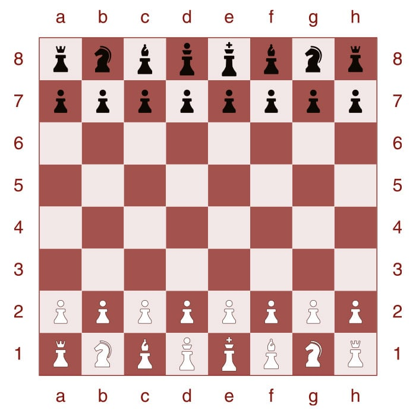

Console-based Chess Game: Project Instruction

**Objective:**

To design and implement a console-based chess game in Java that allows two players to play the
classic game of chess against each other.

**Project Overview:**

1. **Text-Based Chessboard Display:**

The chessboard will be represented using a grid of characters in the console. It will be 8x8 squares
in size, as per standard chess rules.

- **Squares:** Each square can be represented by two pound signs (e.g., "##")
- **Board Coordinates**: The horizontal (file) coordinates should be labeled with letters 'A'
  through 'H' and the vertical (rank) coordinates with numbers '1' through '8'. These labels should
  be displayed on the top and left side of the board to help players identify each square's
  position.

2. **Text Representation of Chess Pieces:**

Different pieces can be represented using letters uppercase or lowercase, white pieces start with
‘w’ and black pieces start with ‘b’.

Pawn: wp (white), bp (black)

Rook: wR (white), bR (black)

Knight: wN (white), bN (black)

Bishop: wB (white), bB (black)

Queen: wQ (white), bQ (black)

King: wK (white), bK (black)

A sample board might start like this:

3. **Making Moves with Standard Chess Notation:**

Players will make moves by typing them into the console using standard chess notation. The basic
format will be [FROM] space [TO].

- **Moving a Piece:** Specify the starting square followed by the destination square. E.g., "E2 E4"
  moves the piece from square E2 to E4.
- **Capture:** The same as moving a piece. The capturing move can be automatically identified by the
  program when a piece moves to a square occupied by an opponent's piece.
- **Castling:** Use "O-O" for kingside (short) castling and "O-O-O" for queenside (long) castling. (
  optional)
- **Pawn Promotion:** When a pawn reaches the opposite end of the board, the player can choose a
  piece for promotion. This can be represented as "E7 E8=Q" to promote a pawn moving from E7 to E8
  into a Queen. (optional)

4. **User Interface Workflow:**

- Display the current state of the chessboard.
- Indicate which player's turn it is.
- Prompt the player to enter their move.
- Validate the move. If it's valid, update the board and switch turns. If not, display an error
  message and prompt for a move again. (optional)
- After each move, check for game-ending conditions like checkmate or stalemate. (optional)

**Suggested high-level object-oriented design:**

1. **Piece (Abstract Class)**

**Attributes**:

- Color (white or black)
- Position (e.g., E2, E4, etc.)

**Methods**:

- possibleMoves(): Returns a list of possible moves from the current position.
- move(Position newPosition): Moves the piece to a new position.

**Subclasses: Pawn, Rook, Knight, Bishop, Queen, King**: Each of these will have its own
implementation of possibleMoves() based on how they move on the board.

2. **Board**

**Attributes:**

- 8x8 matrix of squares (2D array)
- List of captured pieces.

**Methods:**

- getPiece(Position position): Returns the piece at the specified position.
- movePiece(Position from, Position to): Moves a piece from one square to another.
- isCheck(Color color): Checks if a given color is in check. (optional)
- isCheckmate(Color color): Checks if a given color is in checkmate. (optional)
- display(): Prints the board to the console.

3. **Player**

**Attributes:**

- Color (white or black)
- List of available pieces (those that have not been captured)

**Methods:**

- makeMove(): Allows the player to input a move and attempts to execute it on the board.

4. **Game**

**Attributes:**

- Board
- Player (white)
- Player (black)
- CurrentTurn (white or black)

**Methods:**

- start(): Initializes a game.
- end(): Ends a game and declares a winner or a draw.
- play(): edu.txstate.git.rrj29.go_git_ters.Main loop for playing the game. Alternates turns, checks for check/checkmate, and gets
  moves from players.

5. **Position Attributes**:
    1. row
    1. column
5. **Utils (Utility class for helper functions)**

- Include all other helper functions

**Phase one implementation goals:**

1. **Project Setup and Organization**:

- **Packages Creation**: Organize your classes by creating appropriate packages. For instance, have
  a package named **pieces** for all chess piece classes, **board** for the Board class, **utils**
  for utility classes, etc.
- **Class Files Creation**: For every entity in the game (like a Pawn or Board), create an
  associated class file within the relevant package.

2. **Public Interfaces**:

- **Javadoc Annotations**: Ensure each class, interface, method, and attribute is annotated with
  Javadoc comments that describe its purpose and any relevant details.

3. **Documentation Generation**:

- **Javadoc Generation**: Use the Javadoc tool to generate documentation for your project. This
  documentation should be easily accessible and provide insights into the classes, interfaces,
  methods, and attributes of your game.

4. **Piece Implementation**: (no need to be perfect at this stage)

- **Piece Class**: Implement an abstract **Piece** class that will serve as a blueprint for all
  individual chess pieces. This class should define common attributes (e.g., color, position) and
  methods (e.g., possibleMoves()).
- **Subclasses**: Develop subclasses for each individual piece (Pawn, Rook, Knight, Bishop, Queen,
  King). Each subclass should extend the **Piece** class and define its unique movement rules.

5. **Board Implementation**:

- **Board Representation**: The **Board** class should maintain an 8x8 matrix (or another
  appropriate data structure) to represent the chessboard. Each element should store a reference to
  a **Piece** or be null if the square is empty.
- **Initialization**: Implement a method to set up the board with pieces in their initial positions.
- **Display Method**: The board should have a method to display its current state in the console.

6. **Console Interface Workflow**:

- **Prompt for Moves**: Create an interface loop that repeatedly displays the board's current state
  and prompts the user to enter their move in standard chess notation.
- **Move Input**: Accept and parse the player's input to determine the source and destination
  squares for the intended move.
- **Basic Validation**: For this phase, implement a simple validation check to ensure the entered
  move is in the correct format (e.g., "E2 E4"). More complex move validation (like checking if a
  move is legal) can be added in the next phase.

7. **Push code GitHub repository with multiple commits**
7. **Test your classes often to make sure they function properly**

Useful resources:

1. [https://www.geeksforgeeks.org/design-a-chess-game/ ](https://www.geeksforgeeks.org/design-a-chess-game/)
1. Search ‘chess java’ on github.com There should be plenty example repositories
1. [https://github.com/amir650/BlackWidow-Chess/tree/master ](https://github.com/amir650/BlackWidow-Chess/tree/master)
1. An easy implementation. Its code can be run
   directly.[ https://github.com/sagnew/Chess ](https://github.com/sagnew/Chess)
1. Tic Tac Toe
   example[ https://git.txstate.edu/x- l30/CS3354Spring2024/tree/main/ProjectExamples ](https://git.txstate.edu/x-l30/CS3354Spring2024/tree/main/ProjectExamples)
